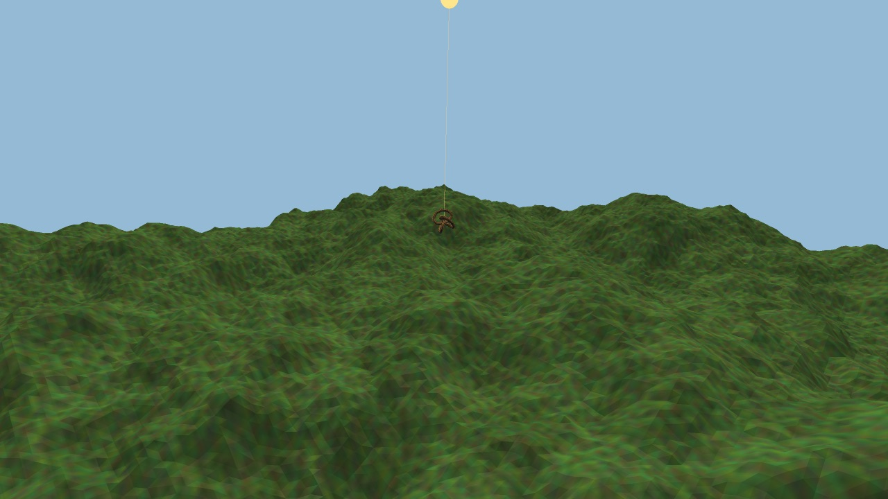

# rlsw-cc

Optimized fork of raylib’s **rlsw** software rasterizer (OpenGL 1.1-style) in [Concurrent-C](https://github.com/sreekotay/concurrent-c) — a strict C11-superset preprocessor: `.ccs` lowers to plain C and compiles with your host C compiler. Span kernels and `@parallel` stripe fill ship as checked-in C plus a portable runtime snapshot.

This repo requires no external toolchain other than what rlsw already uses.



**Showcase / harness:** [rayrender](https://github.com/sreekotay/rayrender) — FetchContents raylib 6.0 + this package, overlays `rlsw.h`, dual binaries vs stock rlsw 1.5, parity benches.

**Consumers do not need `ccc`.** Parallel support uses the checked-in `vendor/cccportable` host-C snapshot.

## Install / use (existing raylib app)

Requirements:

1. **raylib 6.0** built as **Software + RGFW** (`OPENGL_VERSION=Software`, `PLATFORM=RGFW`). GLFW never blits the CPU framebuffer — the window stays black.
2. Drop this repo in (submodule / sibling / FetchContent) and **overlay** it onto raylib’s tree. A `-I` path is not enough: `rlgl.h` does `#include "external/rlsw.h"` relative to raylib `src/`.
3. Link **`rlsw_cc` on the app**, not on the `raylib` target.

```cmake
include(FetchContent)

set(BUILD_EXAMPLES OFF CACHE BOOL "" FORCE)
set(BUILD_GAMES OFF CACHE BOOL "" FORCE)
set(PLATFORM "RGFW" CACHE STRING "" FORCE)
set(OPENGL_VERSION "Software" CACHE STRING "" FORCE)

FetchContent_Declare(raylib
    GIT_REPOSITORY https://github.com/raysan5/raylib.git
    GIT_TAG 6.0
    GIT_SHALLOW TRUE)
FetchContent_MakeAvailable(raylib)

# Local checkout, or FetchContent this repo the same way:
add_subdirectory(path/to/rlsw-cc)
rlsw_cc_overlay_raylib(raylib "${raylib_SOURCE_DIR}")

add_executable(my_app ...)
target_link_libraries(my_app PRIVATE raylib rlsw_cc)
```

That call overlays `include/rlsw.h` (+ span kernels) onto `raylib/src/external/`. It also enables **soft present** by default (see next section).

Optional at runtime (fill-heavy 3D benefits most):

```c
swSetBinSize(0, 64);          // hstripe × 64 (parallel stripe fill)
swSetAdaptiveAffine(true);    // vary 1/w block size
```

### Limits

- **GPU shaders / modern GL** — software path is GL 1.1-style rlsw.

### CMake options

| Option | Default | Meaning |
| --- | --- | --- |
| `RLSW_CC_PARALLEL` | `ON` | `@parallel` stripes via `vendor/cccportable` (no `ccc`) |
| `RLSW_CC_USE_STOCK` | `OFF` | Overlay `stock/rlsw.h` instead of the fork |
| `RLSW_CC_SOFT_PRESENT` | `ON` | Patch RGFW present (see Soft present) |

## Soft present

Separate from the raster fork: how the finished CPU framebuffer reaches the window.

Stock raylib RGFW software swap on desktop often does a full-frame channel scramble and (on macOS) an expensive NSImage/CMS path. Soft present patches that swap at configure time:

| Platform | What it does |
| --- | --- |
| **macOS** | `swGetColorBuffer` → Y-flip into a **triple-buffered** staging surface → `CGImage` → `CALayer` (avoids racing Core Animation on the live FB) |
| **Linux / Windows** | `swReadPixels` into a **BGRA** surface that matches native RGFW blit (no extra R↔B pass when formats align) |

Sources live under `cmake/overlays/` (`apply_sw_present.py`, `macos_sw_present.c`). Applied automatically by `rlsw_cc_overlay_raylib()`.

```cmake
# default — included in the overlay
rlsw_cc_overlay_raylib(raylib "${raylib_SOURCE_DIR}")

# or turn it off (stock RGFW blit only)
cmake -DRLSW_CC_SOFT_PRESENT=OFF ...
```

If you build a second raylib target that shares the same patched sources (e.g. a stock referee), also:

```cmake
rlsw_cc_soft_present_attach(raylib_stock)   # Apple: link macos_sw_present.c
```

## Performance vs stock rlsw 1.5

Apple Silicon, [rayrender](https://github.com/sreekotay/rayrender) maze, quality 2, adaptive on, **hstripe** parallel fill. Means of **3×60-frame** runs (`RAYRENDER_FRAMES=60 ./tools/parity.sh` — short 12-frame runs are noisy):

| Mode | Window (draw FB) | Filter | stock ms | cc ms | vs stock |
| --- | --- | --- | ---: | ---: | ---: |
| bench | 1280×720 (2560×1440) | point | 1138 | 330 | **3.45×** |
| bench | 1280×720 (2560×1440) | bilinear | 1754 | 379 | **4.63×** |
| retina | 2560×1440 (5120×2880) | point | 4128 | 949 | **4.35×** |
| retina | 2560×1440 (5120×2880) | bilinear | 6587 | 1195 | **5.51×** |

Checksums intentionally DIFF vs stock after bary-plane / integer-span work; cc bench point stays `0x2e13ab57d738130a`.

## Layout

| Path | Role |
| --- | --- |
| `include/rlsw.h` | Fork (replaces raylib `src/external/rlsw.h`) |
| `include/generated/*.c` | Checked-in emits (`span_kernels` `#include`d from `rlsw.h`; `bin_par` own TU) |
| `vendor/cccportable/` | Host-C headers + runtime (`ccc portable-install`) |
| `stock/rlsw.h` | Untouched rlsw 1.5 referee |
| `src/fill/*.ccs` | Concurrent-C sources (authors only) |
| `CMakeLists.txt` | Overlay helper + `rlsw_cc` library |
| `cmake/overlays/` | Soft present (RGFW swap patch + macOS CGImage) |

## Authors (have `ccc`)

```bash
./tools/gen.sh            # emit --no-line into include/generated/
./tools/vendor-ccc.sh     # refresh vendor/cccportable
```

CMake never runs `ccc`. Kernels use `#pragma(@prelude) off` + `#ifdef CC_PARSER_MODE` host stubs (inert inside `rlsw.h`).

## Extra APIs (vs stock rlsw)

- `swSetAdaptiveAffine(bool)` — vary `1/w` block size
- `swSetBinSize(int w, int h)` — bins / stripes (`w=0` → hstripe; `h=0` → vstripe)
- `swSetSeq(bool)` — force sequential stripe fill

See `NOTES.md` for the phase log. End-to-end benches and HUD live in [rayrender](https://github.com/sreekotay/rayrender).
